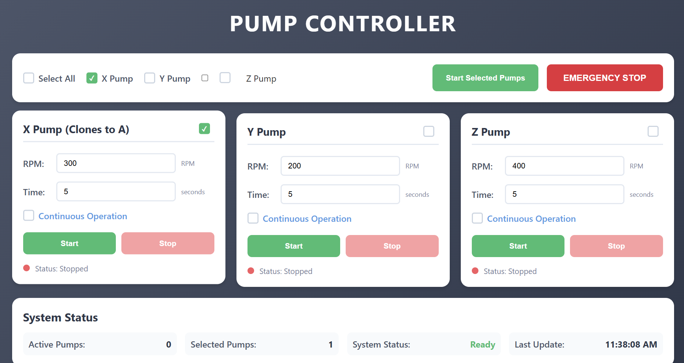

# 🔧 Peristaltic Pump Control System

A comprehensive multi-pump control system designed for precise fluid handling using peristaltic pumps with four rollers. This system supports simultaneous operation of up to 4 pumps with web-based control interface and Arduino-based hardware control.



## 📋 Table of Contents

- [Overview](#overview)
- [Features](#features)
- [System Architecture](#system-architecture)
- [Hardware Requirements](#hardware-requirements)
- [Software Requirements](#software-requirements)
- [Installation](#installation)
- [Usage](#usage)
- [Project Structure](#project-structure)
- [Technical Specifications](#technical-specifications)
- [Future Development](#future-development)
- [Contributing](#contributing)

## 🔍 Overview

This Peristaltic Pump Control System is designed to control four peristaltic pumps simultaneously through a modern web interface. The system uses Arduino for hardware control and a Python Flask backend for communication and web serving. Each pump can handle fluids with viscosities up to 60,000 cP (centipoise), making it suitable for a wide range of applications from water to highly viscous fluids.

### Key Characteristics:
- **Pump Type**: Peristaltic pumps with four rollers each
- **Simultaneous Operation**: All 4 pumps can run concurrently
- **Synchronized Timing**: All pumps stop when the shortest timer expires (shared clock system)
- **Viscosity Range**: Supports fluids up to 60K cP
- **RPM Accuracy**: Input RPM is nominal - actual pump RPM affected by torque, load, and gear ratios

## ✨ Features

- **Web-Based Control Interface**: Modern, responsive dashboard for pump control
- **Real-Time Status Monitoring**: Live updates of pump states and system status
- **Individual Pump Control**: Start/stop each pump independently
- **Batch Operation**: Select and control multiple pumps simultaneously
- **Emergency Stop**: Immediate shutdown of all pumps for safety
- **Continuous Operation Mode**: Option for indefinite pump operation
- **Serial Communication**: Robust Arduino-Python communication via USB
- **Auto-Discovery**: Automatic detection of Arduino on various COM ports
- **Cross-Platform Support**: Works on Windows, macOS, and Linux

## 🏗️ System Architecture

```
┌─────────────────┐    HTTP/WebSocket    ┌─────────────────┐    Serial USB    ┌─────────────────┐
│   Web Browser   │ ◄──────────────────► │  Python Flask   │ ◄──────────────► │   Arduino Uno   │
│   (Frontend)    │                      │   (Backend)     │                  │  (Controller)   │
└─────────────────┘                      └─────────────────┘                  └─────────────────┘
        │                                        │                                     │
        ├─ HTML/CSS/JavaScript                  ├─ Flask API Endpoints                ├─ DRV8825 Drivers
        ├─ Real-time Updates                    ├─ Serial Communication               ├─ Stepper Motors
        └─ Responsive Design                    └─ CORS Support                       └─ Pump Control Logic
```

## 🔧 Hardware Requirements

- **Arduino Uno** (or compatible microcontroller)
- **4x DRV8825 Stepper Motor Drivers**
- **4x Stepper Motors** (NEMA 17 recommended)
- **4x Peristaltic Pump Heads** (4-roller design)
- **Power Supply** (12V, 1.5A)
- **USB Cable** (Arduino to Computer connection)
- **Breadboard/PCB** CNC shiled V3
- **Jumper Wires**

### Pin Configuration:
```
Pump X: Step=2, Dir=5,  Enable=8
Pump Y: Step=3, Dir=6,  Enable=8  
Pump Z: Step=4, Dir=7,  Enable=8
Pump A: Step=12,Dir=13, Enable=8
```

## 💻 Software Requirements

### Python Dependencies:
```bash
pip install flask flask-cors pyserial
```

### System Requirements:
- **Python 3.7+**
- **Arduino IDE** (for uploading firmware)
- **Modern Web Browser** (Chrome, Firefox, Safari, Edge)
- **USB Drivers** (for Arduino communication)

## 🚀 Installation

### 1. Clone the Repository
```bash
git clone https://github.com/gaborekweK/P_PumpControl_.git
cd P_PumpControl_
```

### 2. Install Python Dependencies
```bash
pip install flask flask-cors pyserial
```

### 3. Upload Arduino Firmware
1. Open `PumpControlSystem/arduino/PumpController/PumpController.ino` in Arduino IDE
2. Select your Arduino board and COM port
3. Upload the sketch to your Arduino

### 4. Hardware Setup
1. Connect DRV8825 drivers to Arduino according to pin configuration
2. Connect stepper motors to drivers
3. Attach peristaltic pump heads to motors
4. Connect power supply to drivers
5. Connect Arduino to computer via USB

### 5. Start the System
```bash
cd PumpControlSystem/python_backend
python main.py
```

### 6. Access Web Interface
Open your browser and navigate to: `http://localhost:5000`

## 📖 Usage

### Web Interface Controls:

1. **Individual Pump Control**:
   - Set RPM (0-1000 range in UI)
   - Set duration in seconds
   - Enable/disable continuous operation
   - Start/Stop individual pumps

2. **Batch Operations**:
   - Select multiple pumps using checkboxes
   - Use "Select All" for all pumps
   - Click "Start Selected Pumps" for simultaneous operation

3. **Safety Features**:
   - Emergency Stop button for immediate shutdown
   - Real-time status indicators
   - System status monitoring

### Command Line Interface:
The system also accepts direct serial commands:
```
START,X,50,10,0    # Start pump X at 50 RPM for 10 seconds
STOP,X             # Stop pump X
EMERGENCY          # Emergency stop all pumps
STATUS             # Get pump status
```

## 📁 Project Structure

```
P_PumpControl_/
├── README.md                              # This file
├── PumpControlSystem/
│   ├── arduino/
│   │   └── PumpController/
│   │       └── PumpController.ino         # Arduino firmware
│   ├── python_backend/
│   │   ├── main.py                        # Flask web server
│   │   ├── serial_handler.py             # Arduino communication
│   │   ├── __pycache__/                  # Python cache
│   │   └── frontend/
│   │       ├── index.html               # Web interface
│   │       ├── script.js                # Frontend JavaScript
│   │       └── style.css                # Styling
│   └── Dashboard/
│       └── UI.png                        # Interface screenshot
```

### File Descriptions:

- **`main.py`**: Flask web server providing REST API endpoints and serving the web interface
- **`serial_handler.py`**: Manages serial communication with Arduino, including auto-detection and error handling
- **`PumpController.ino`**: Arduino firmware with direct pulse control for high-RPM operation
- **`index.html`**: Responsive web interface with pump controls and status monitoring
- **`script.js`**: Frontend logic for API communication and real-time updates
- **`style.css`**: Modern styling with animations and responsive design

## ⚙️ Technical Specifications

### Pump Performance:
- **Maximum Fluid Viscosity**: 60,000 cP (centipoise)
- **Flow Rate Reduction Factor**: ~5x when pumping water (due to gear ratios and load)
- **RPM Range**: 0-3000 RPM (firmware limit)
- **UI RPM Range**: 0-1000 RPM (recommended operating range)
- **Timer Resolution**: 1 second
- **Stepper Resolution**: 200 steps/rev × 16 microsteps = 3200 steps/rev

### Communication:
- **Serial Baud Rate**: 9600 bps
- **Protocol**: Text-based commands with JSON status responses
- **Update Frequency**: 2-second status polling
- **Timeout**: 2 seconds for Arduino responses

### Web Interface:
- **Port**: 5000 (default)
- **API Format**: RESTful JSON endpoints
- **Real-time Updates**: JavaScript polling every 2 seconds
- **Browser Support**: Modern browsers with ES6 support

## 🔮 Future Development

I am currently working on an enhanced version that will include:

### Upcoming Features:
- **Volume Dispensing System**: Calibrated volume control instead of time-based operation
- **Machine Learning Integration**: Viscosity-based flow prediction and compensation
- **Flow Sensors**: Raw ADC value monitoring for real-time flow measurement
- **PID Control**: Automatic flow rate correction for fluctuations
- **Calibration Database**: Pump-specific calibration data storage
- **Advanced Analytics**: Historical data logging and analysis

### Planned Improvements:
- Real-time flow rate feedback
- Viscosity compensation algorithms
- Automated calibration procedures
- Enhanced web interface with data visualization
- Mobile app development
- Cloud connectivity options

## ⚠️ Important Notes

1. **RPM Accuracy**: The RPM values entered in the dashboard are nominal. Actual pump RPM will be affected by:
   - Motor torque characteristics
   - Fluid load and viscosity
   - Gear ratios in the pump head
   - Power supply voltage

2. **Synchronized Operation**: When multiple pumps run simultaneously, all pumps will stop when the shortest timer expires due to the shared clock system.

3. **Viscosity Limitations**: While the system supports fluids up to 60K cP, performance may vary based on pump head design and motor specifications.

4. **Current Limitations**: This version does not include volume dispensing calibration. Volume control is achieved through time-based operation.


*This system represents a robust foundation for peristaltic pump control with plans for significant enhancements in volume dispensing accuracy and intelligent flow control.*